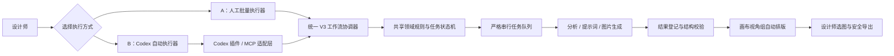
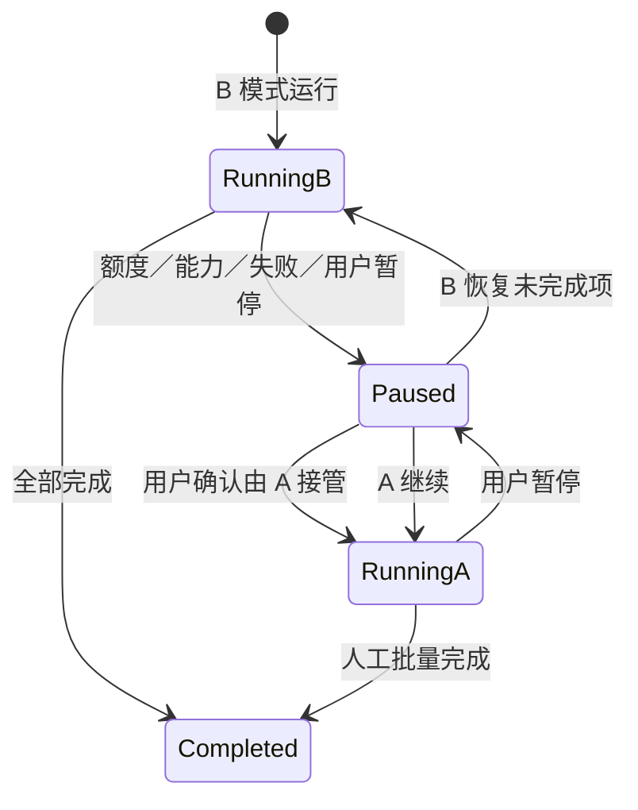

# D5 AI 画布 × Codex A/B 双轨工作流项目计划书

> 文档版本：V1.0<br>
> 编制日期：2026-08-10<br>
> 对应产品：GPT Infinite Canvas V3 / D5 AI Pipeline<br>
> 当前版本基线：0.4.0<br>
> 实施版本：0.5.2（P0—P5 已完成，支持当前画布或项目文件夹双启动来源）<br>
> 项目目录：`D:\OneDrive - 静超科技\D5-AI-Pipeline`

> **实施状态｜已落地。** 本计划已完成代码、插件、安装器、测试、隔离浏览器验收和发布包验证。最终证据与暂未执行的生产授权动作见《Codex A/B 双轨工作流实施验收报告》；本文件保留原建设逻辑和工期估算，作为立项与复盘依据。

---

## 1. 项目结论

本构想可落地，且与当前项目架构具有较高复用度。

推荐将产品升级为“一套 V3 工作流、两个执行器、同一个画布结果”的 A/B 双轨体系：

- **A 模式｜人工批量执行**：由设计师在现有画布中组织任务、批量提交和人工确认，继续复用浏览器扩展、桥接服务、严格串行队列和自动回收能力；减少 Codex 消耗，同时保留批量效率。
- **B 模式｜Codex 自动执行**：设计师可直接使用当前画布图片，或指定项目文件夹导入新批次；确认阶段和运行范围后，Codex 调用受限的工作流工具完成分析、提示词、生图、结果登记和画布排版。
- **A/B 共用同一套项目数据、阶段语义、任务状态、版本关系、排版规则和导出规则**，仅执行者不同，不建设两套工作流。
- **B 模式额度不足、能力不可用或任务被占用时，可在任务检查点由 A 模式接管未完成项**；已成功的成果不重复生成。
- **最终采用哪张成果图始终由设计师决定**。Codex 可以生成、验证和排列，不自动替代最终人工选图。

项目建议按“先接通、再自动、后稳定”的顺序实施。预计：

| 交付层级 | 范围 | 预计工期 |
|---|---|---:|
| 技术验证 | Codex 连接、读取项目、写入文字卡、自动排版，不生图 | 2—3 个开发日 |
| 可用 MVP | 文件夹导入、前置检查、优化生图、结果回写、暂停恢复 | 7—10 个开发日 |
| 生产稳定版 | 三阶段完整覆盖、A/B 接管、并发保护、安全校验、发布验收 | 16—23 个开发日 |

> 工期按单人连续开发估算，不含外部接口变化、设计反馈等待和大规模历史项目人工整理时间。

---

## 2. 建设背景

当前项目已经完成 V3 三阶段工作流、无限画布、项目保存、批量任务、浏览器桥接、结果回收、版本管理和安全导出等核心能力。

现阶段的主要矛盾不是“缺少工作流”，而是工作流仍需要设计师持续操作：

- 选择文件和图片角色；
- 逐项发起分析或生成；
- 等待并回收结果；
- 将意见、原图和效果图整理到统一位置；
- 在额度、失败和其他任务之间手动切换。

因此，本次升级不重做画布，也不改写 V3 业务逻辑，而是在现有工作流之上增加统一执行层，使同一批任务既能由人工驱动，也能由 Codex 代理执行。

---

## 3. 项目目标

### 3.1 核心目标

1. 用户在 B 模式下可从当前画布直接启动；只有需要导入新批次时才提供项目文件夹。确认目标阶段和运行范围后即可启动批量处理。
2. Codex 自动完成只读扫描、导入清单、角色识别、任务执行、结果登记和画布排列。
3. 画布按视角形成稳定的“修改意见—原图—参考效果图”表达单元。
4. A、B 两种模式共享同一任务状态，允许按单项或剩余批次无损接管。
5. 保留现有 V3 三阶段、结构保护、严格串行、安全导出和人工验收原则。
6. 所有自动化均可暂停、恢复、追踪和审计，不直接修改项目源文件。

### 3.2 非目标

- 不建设第二套独立画布。
- 不把 V3 三阶段重新改成强制串联流程。
- 不恢复已废弃的旧四阶段语义。
- 不允许 Codex 直接编辑 `project.json` 或绕过领域校验写入资产。
- 不让 Codex 自动认定最终采用版本。
- 不在首期把 Codex 对话界面嵌入画布内部。
- 不以自动扫描整台电脑代替用户明确指定项目文件夹。

---

## 4. 现有能力基线与复用判断

### 4.1 当前稳定基线

截至 2026-08-10，最新回归基线为 **136 项测试全部通过**：

| 范围 | 当前通过数 |
|---|---:|
| 共享协议 | 4 |
| 桥接服务 | 17 |
| 浏览器扩展 | 12 |
| 画布应用 | 103 |
| 合计 | 136 |

本项目实施必须以 136 项为起点，不得删除、跳过或弱化既有回归。历史 `V3测试与验收报告.md` 记录的是 V3 首次验收时的 111 项；最新数量以《已修复问题与回归保护基线》为准。

### 4.2 能力复用清单

| 现有能力 | 现状 | 本项目处理方式 |
|---|---|---|
| 本地无限画布 | 已稳定 | 直接复用 |
| 文件夹选图与自然排序 | 已具备浏览器侧导入 | 扩展为 Codex 文件夹清单导入 |
| V3 三阶段工作流 | 已稳定 | 作为唯一业务标准 |
| D5／SU 一一配对 | 已具备 | 复用并增加自动识别置信度 |
| 结构图／风格图角色 | 已具备 | 复用角色语义 |
| 图片批量选择 | 已具备 | 复用为 A 模式入口和 B 模式范围确认 |
| 严格串行任务队列 | 已具备 | A/B 共用，不并行乱序生成 |
| 任务暂停、恢复和去重 | 已具备稳定底座 | 扩展执行器和检查点字段 |
| 生成结果自动回收 | 已具备 | B 模式直接登记同一结果协议 |
| 父子版本关系 | 已具备 | 复用，增加运行批次追踪 |
| 文字结果卡 | 已具备 | 扩展为左侧修改意见／提示词卡 |
| 同源结果右侧排列 | 已具备 | 升级为三栏视角组布局 |
| 安全导出、顺延命名、SHA-256 | 已具备 | 直接复用 |
| 本地桥接与 Token | 已具备 | 作为 MCP 适配层的下游服务 |
| 安装器、启动器、发布冒烟 | 已具备 | 增加 Codex 集成安装与诊断 |

### 4.3 需要新增的核心能力

1. 项目文件夹的只读扫描、清单预览和可控导入。
2. 统一 `WorkflowRunner` 执行器接口。
3. `ManualBatchRunner` 与 `CodexRunner` 两种实现。
4. Codex 插件及本地 MCP 适配层。
5. Codex 运行授权单、批次上限和停止条件。
6. A/B 接管、任务租约、幂等键和版本冲突保护。
7. “意见在左、原图居中、成果在右”的视角组布局。
8. 能力不足或额度受限时的暂停与人工接管机制。

---

## 5. 产品总体方案

### 5.1 产品入口

在现有画布工作台增加两个明确入口：

| 入口 | 适用场景 | 用户操作 |
|---|---|---|
| **A｜人工批量运行** | Codex 额度不足、Codex 正在处理其他任务、需要逐项判断 | 选图或选批次，人工确认提交，系统负责队列、回收和排版 |
| **B｜Codex 自动运行** | 批量任务、规则稳定、希望减少持续人工操作 | 直接使用当前画布，或从项目文件夹导入新批次；确认阶段、范围和预算上限后交给 Codex |

模式不是项目的永久属性，而是**批次或任务项的执行属性**。同一项目可以：

- 前置检查用 B；
- 重点视角用 A；
- 场景优化先 B 批量生成，再由 A 精修个别视角；
- B 中断后由 A 接管剩余任务；
- A 完成人工调整后，再把未执行项交还 B。

### 5.2 统一架构



关键原则：

- A/B 只决定“谁来执行”，不决定“工作流是什么”。
- 所有写入都经过现有桥接服务和共享领域规则。
- Codex 只调用结构化工具，不直接操作底层项目文件。
- 任务状态是唯一事实来源；画布显示、Codex 对话和浏览器扩展都读取同一状态。

---

## 6. A 模式设计｜人工批量执行

### 6.1 定位

A 模式是现有工作流的增强版，不是纯手工模式。

设计师保留关键判断，系统继续自动完成：

- 批量选择和任务编排；
- 严格串行提交；
- 浏览器绑定和结果监听；
- 生成结果自动回收；
- 父子版本登记；
- 同视角成果自动排列；
- 失败项保留和继续执行；
- 最终成果安全导出。

### 6.2 适用边界

- Codex 使用额度不足或当前不可用；
- 需要高度主观的设计判断；
- 重点视角需要逐轮提示词调整；
- 项目文件命名混乱，自动配对置信度较低；
- 用户不希望授权自动生图。

### 6.3 优化重点

- 增加“仅运行未完成项”。
- 增加“接管 B 剩余任务”。
- 显示每项来源执行器、当前状态和失败原因。
- 继续保留当前批次统一任务要求，不因混合选择而丢失上下文。

---

## 7. B 模式设计｜Codex 自动执行

### 7.1 推荐使用方式

正式入口采用本地 **D5 AI Canvas Codex 插件**：

1. 插件注册项目专用 MCP 服务；
2. MCP 适配层连接现有本地桥接服务；
3. Codex 调用领域工具读取项目和执行工作流；
4. 画布实时显示运行状态和结果；
5. 用户在 Codex 或画布中都可暂停，但最终选图在画布完成。

推荐默认链路为：

```text
Codex Desktop
  → 插件启动的 STDIO MCP 适配层
  → 现有 Bridge（默认 127.0.0.1:3220）
  → 现有 Canvas（默认 127.0.0.1:3230）与项目存储
```

该方式借鉴“Codex 插件 + 本地 Agent/MCP + Token”的连接思想，但不复制另一套常驻 Agent。现有 Bridge 继续作为唯一领域服务，MCP 只做协议适配和权限收口，从而避免任务、Token、端口和项目状态出现两套来源。

保留“本地地址 + Connect Token”作为开发、排错和手动连接方式，不作为日常主入口。

### 7.2 首期不采用的方式

首期不把 Codex 完整聊天侧栏嵌入画布。Codex App Server 更适合后续深度集成，其 WebSocket 方式仍应视为实验性边界；MVP 优先使用本地 MCP，降低实现和维护成本。

### 7.3 Codex 运行授权单

B 模式启动前必须由用户确认一次结构化授权单：

| 字段 | 示例 |
|---|---|
| 项目文件夹 | `D:\项目\产业园投标\效果图` |
| 当前阶段 | 场景优化 |
| 处理范围 | 8 个待处理视角 |
| 结构依据 | 每个视角的 D5 原图；配对 SU 可选 |
| 风格参考 | 指定参考图或不使用 |
| 每视角版本数 | 重点视角 2 张，其余 1 张 |
| 最大生成量 | 10 张 |
| 执行模式 | 严格串行 |
| 停止条件 | 结构校验失败、配对不明确、额度／能力不可用、连续失败达到阈值 |
| 降级策略 | 暂停并提示；是否允许一键转 A 由用户选择 |

用户确认后，授权单范围内的生图不再逐张重复询问；超出数量、阶段、文件夹或角色范围必须再次确认。

### 7.4 能力与额度处理

系统不依赖“精确读取剩余额度”作为唯一判断，因为客户端未必能稳定提供可用余额接口。推荐采用：

- 启动前检查当前 Codex 会话和图片生成能力是否可用；
- 用户设置本批最大生成数量；
- 记录已使用数量和失败次数；
- 发现能力不可用、达到上限或响应异常时暂停；
- 提供“由 A 接管剩余项”，默认不静默自动切换。

Codex 内置图片生成会计入 Codex 使用量；较大批量如果未来超过桌面交互式任务的合理范围，再评估独立 API 队列，不纳入本期 MVP。

---

## 8. 三阶段自动化任务设计

项目文件夹扫描属于“项目初始化事务”，不是新增的第四工作流阶段。

### 8.1 任务 0｜项目初始化与导入

输入：用户明确指定的项目文件夹。

执行：

1. 解析并规范化绝对路径；
2. 只读扫描允许的图片格式；
3. 忽略临时文件、隐藏缓存和不支持格式；
4. 生成导入清单，不立即修改源目录；
5. 按命名、尺寸和邻近关系建议 D5／SU／风格参考角色；
6. 对低置信度配对标红，等待用户确认；
7. 将确认资产复制进入画布项目资产区；
8. 生成项目日志、资产哈希和导入结果；
9. 在画布中按视角创建初始分组。

安全要求：

- 不扫描用户未指定目录；
- 不修改、移动或删除源文件；
- 防止路径穿越和符号链接越界；
- 同名文件顺延，不覆盖现有画布资产；
- 支持“仅预览清单，不导入”的 dry-run 模式。

### 8.2 任务 1｜前置检查

输入：每个视角 1 张 D5 截图，可选配对 1 张 SU 截图。

输出：仅文字修改意见，不生图。

自动执行：

- 每个视角建立独立任务；
- 按 P1／P2／P3 输出不超过 3 条问题；
- 每条意见包含位置、现状、风险和建议；
- 结果写入原图左侧的“前置检查意见卡”；
- 严重结构问题触发暂停，不自动进入该视角后续生图。

### 8.3 任务 2｜场景优化

输入：结构底图必选，风格参考可选。

内部保持两个独立检查点：

- **A 模式 02A／02B**：保留“生成／优化提示词”和“按提示词生成图片”两个独立人工动作，适合逐轮调整。
- **B 模式连续任务**：授权单确认后，Codex 依次生成并登记提示词卡、读取已批准提示词、提交生图并登记场景优化目标图；提示词卡是中间检查点，不再要求用户二次选择动作。

版本规则：

- 普通视角默认 1 张；
- 重点视角默认 2 张；
- 同一视角严格串行；
- 结构漂移、视角变化或场地边界变化时标记不合格，不自动采用。

### 8.4 任务 3｜最终玻璃深化

输入：仅最终 D5 完整图。

执行：

- 不接收蒙版、通道、SU 截图或局部裁切；
- 默认每张生成 1 个版本；
- 保持建筑结构、体块、视角、道路和场地边界；
- 检查输出尺寸、长宽比和完整画面；
- 合格结果排列到原图右侧；
- 用户人工勾选最终采用版本后，调用现有安全导出。

### 8.5 阶段关系

- 三个阶段仍可直接进入；
- 不设置跨阶段完成门槛；
- 只校验当前动作所需输入；
- 前置检查发现问题可以阻止当前视角继续自动生成，但不锁死其他视角或其他阶段。

---

## 9. 画布结果布局

### 9.1 标准视角组

每个视角形成一个可整体移动、可折叠的工作单元：

```text
┌────────────────┐   ┌────────────────────┐   ┌────────────────────────┐
│ 修改意见／提示词 │ → │ 原图／唯一结构依据   │ → │ 参考效果图 V1、V2……    │
│ 状态、风险、批注 │   │ D5；可附属 SU／风格图 │   │ 校验状态、执行器、时间   │
└────────────────┘   └────────────────────┘   └────────────────────────┘
        左                         中                         右
```

### 9.2 布局规则

- 修改意见卡位于原图左侧，提示词卡可与意见卡上下排列；
- 原图始终位于视觉中心，作为唯一结构依据；
- 生成结果按时间或版本从左到右、从上到下排列；
- 风格参考图不进入主成果序列，可附着在原图上方；
- 多个结果支持折叠，但不改变版本关系；
- A/B 执行器切换不改变视角组位置；
- 自动排版不得覆盖用户已手动锁定的位置；
- 旧项目默认保留原布局，只有用户执行“整理为三栏视角组”时才迁移。

### 9.3 与当前布局的差异

当前文字结果主要放置在来源图右侧。本项目将“修改意见卡左置”作为明确的新行为，需要新增布局迁移、撤销／重做、混合选择和防重叠回归测试。

---

## 10. 统一状态与数据模型

### 10.1 核心类型建议

```ts
type RunnerKind = "manual" | "codex";

type RunStatus =
  | "draft"
  | "awaiting-authorization"
  | "queued"
  | "running"
  | "paused"
  | "needs-review"
  | "completed"
  | "failed"
  | "cancelled";

type RunCheckpoint =
  | "manifest-confirmed"
  | "analysis-completed"
  | "prompt-approved"
  | "generation-submitted"
  | "result-registered"
  | "validation-completed"
  | "human-selected"
  | "exported";

interface WorkflowRun {
  runId: string;
  projectId: string;
  stage: "preflight" | "scene-optimization" | "final-glass";
  runner: RunnerKind;
  status: RunStatus;
  authorizationId?: string;
  codexThreadId?: string;
  leaseOwner?: string;
  leaseExpiresAt?: string;
  createdAt: string;
  updatedAt: string;
}

interface WorkflowRunItem {
  itemId: string;
  runId: string;
  viewpointId: string;
  runner: RunnerKind;
  status: RunStatus;
  checkpoint?: RunCheckpoint;
  sourceVersionIds: string[];
  resultVersionIds: string[];
  sourceHash: string;
  promptHash?: string;
  idempotencyKey: string;
  attemptCount: number;
  errorCode?: string;
  errorMessage?: string;
}
```

### 10.2 状态原则

- 任务项是接管和恢复的最小单位；
- 已完成项不因切换执行器而重跑；
- `idempotencyKey` 防止重复提交和重复登记；
- `sourceHash + promptHash` 用于判断结果是否仍对应当前输入；
- 项目写入使用单项目租约或乐观版本号，防止 A/B 同时写入；
- 所有状态变更写入持久日志；
- 中断后从最后一个安全检查点恢复。

---

## 11. Codex / MCP 工具设计

### 11.1 设计原则

- 提供领域工具，不提供任意文件写入或任意画布操作工具；
- 读取工具可自动执行；
- 导入、生成和写入必须受项目、阶段和授权单约束；
- 删除、覆盖源文件和自动最终选图不开放；
- 每次工具调用返回结构化状态、日志位置和下一步建议。

### 11.2 建议工具清单

| 工具 | 作用 | 写入级别 |
|---|---|---|
| `d5_get_capabilities` | 检查桥接、画布、Codex 生图能力和版本 | 只读 |
| `d5_scan_project_folder` | 只读扫描指定文件夹并生成导入清单 | 只读 |
| `d5_import_manifest` | 按已确认清单复制资产并建立视角组 | 受限写入 |
| `d5_open_project` | 打开或切换当前画布项目 | 受限写入 |
| `d5_get_workflow_state` | 读取阶段、视角、版本和任务状态 | 只读 |
| `d5_create_run` | 按授权单创建批次 | 受限写入 |
| `d5_run_preflight_item` | 运行单个前置检查项 | 受限写入 |
| `d5_register_text_card` | 登记意见卡或提示词卡 | 受限写入 |
| `d5_register_generated_result` | 登记生成图及父子版本 | 受限写入 |
| `d5_arrange_viewpoint_group` | 执行三栏视角组排版 | 受限写入 |
| `d5_validate_result` | 校验尺寸、比例、完整性和结构风险 | 只读／写状态 |
| `d5_pause_run` | 在安全检查点暂停 | 状态写入 |
| `d5_handoff_run_items` | 将未完成项在 A/B 之间接管 | 状态写入 |
| `d5_resume_run` | 从检查点恢复剩余任务 | 状态写入 |

### 11.3 不开放的工具

- 任意删除画布节点；
- 任意覆盖项目源资产；
- 任意执行本机命令；
- 任意扫描未授权目录；
- 绕过状态机直接改项目 JSON；
- 自动勾选最终采用版本；
- 无数量上限的批量生图。

---

## 12. A/B 接管与降级规则

### 12.1 接管流程



### 12.2 强制规则

- 默认只暂停并提示，不静默将 B 切换为 A；
- 用户可在授权单中勾选“B 不可用时允许提示一键转 A”；
- 接管只处理 `queued / paused / failed-retryable` 项；
- `completed / result-registered` 项不得重复提交；
- 已提交但尚未回收结果的项进入 `generation-submitted`，接管前先查询和等待，避免双重生成；
- 执行器切换必须写入日志，显示操作者、时间和原因；
- 同一项目同一任务项同时只能有一个有效租约。

---

## 13. 模块改造范围

### 13.1 `01_canvas_app`

- 增加 A/B 双入口和当前执行器标识；
- 增加 Codex 运行授权单；
- 增加批次状态、能力状态和接管按钮；
- 增加三栏视角组布局；
- 增加位置锁定和旧布局手动迁移；
- 显示运行日志、失败原因、检查点和剩余生成数量；
- 最终采用仍使用现有人工选择与导出区。

### 13.2 `02_bridge_service`

- 增加项目文件夹清单扫描接口；
- 增加运行批次、任务项、租约和接管接口；
- 增加 MCP 适配所需的领域 API；
- 增加幂等提交、状态恢复和冲突检测；
- 保留现有 Token，并增加来源绑定、项目范围和调用日志；
- 不允许 API 直接覆盖源资产。

### 13.3 `03_browser_extension`

- 继续服务 A 模式；
- 接受统一运行批次和任务项 ID；
- 与 B 模式共享提交锁、结果去重和回收状态；
- 增加“已由其他执行器接管”的停止保护；
- 不让扩展和 Codex 同时提交同一个任务项。

### 13.4 `04_shared_packages`

- 新增 Runner、Run、RunItem、Authorization、Manifest 协议；
- 统一错误码、检查点、能力信息和接管原因；
- 固化三阶段合法输入／输出组合；
- 增加版本迁移，保持历史项目可读。

### 13.5 `05_installer_ops`

- 安装或更新 D5 AI Canvas Codex 插件；
- 安装固定版本的本地 MCP 适配服务；
- 增加健康检查、端口检查、Token 检查和版本诊断；
- 备份已有配置，不覆盖唯一可恢复副本；
- 发布包冒烟增加 Codex 连接验证。

### 13.6 建议新增 `06_codex_integration`

建议将 Codex 相关能力独立封装，避免污染画布核心：

```text
06_codex_integration/
├─ mcp-server/          # MCP 工具定义与桥接适配
├─ plugin/              # Codex 插件清单和安装配置
├─ skills/              # 打开画布、导入、三阶段执行说明
├─ schemas/             # 授权单、清单和工具输入输出
└─ tests/               # MCP 协议、权限、幂等与恢复测试
```

正式发布不使用每次启动都临时下载的 `npx -y` 方式；依赖应固定版本并随安装器管理。

---

## 14. 分期实施计划

### P0｜基线固化与技术验证｜1—2 日

交付：

- 重新执行并记录当前 136 项回归；
- 建立独立开发项目副本和测试资产；
- 确认桥接 API、Token、项目写入和画布刷新链路；
- Codex 通过 MCP 读取项目状态；
- Codex 创建一张测试文字卡并自动排版；
- 不接入真实图片生成。

退出条件：Codex 能在不直接编辑项目文件的前提下安全读写测试项目。

### P1｜统一执行器与文件夹清单｜3—4 日

交付：

- `WorkflowRunner`、Run、RunItem 和检查点模型；
- `ManualBatchRunner` 适配现有批量队列；
- 文件夹 dry-run 扫描与导入清单；
- D5／SU／风格参考角色建议；
- 项目资产复制、哈希、日志和同名顺延；
- 视角组初始创建。

退出条件：A 模式行为不退化；指定文件夹可以安全预览并导入。

### P2｜Codex 插件与前置检查｜3—4 日

交付：

- `06_codex_integration`；
- 插件安装和 MCP 工具；
- Codex 能力检查；
- B 模式运行授权单；
- 前置检查批量执行；
- 意见卡左置和三栏布局初版；
- 暂停、恢复和日志。

退出条件：用户只给文件夹和阶段，B 模式能完成导入、前置检查和排版。

### P3｜场景优化、生图与 A/B 接管｜4—6 日

交付：

- 02A 提示词检查点；
- 02B Codex 图片生成；
- 版本数量上限和严格串行；
- 结果登记、父子关系和结构风险状态；
- B 暂停后 A 一键接管；
- A 完成部分任务后 B 恢复剩余项；
- 幂等、租约和并发保护。

退出条件：混合执行不重复生成、不丢结果、不破坏版本关系。

### P4｜最终玻璃深化与验收闭环｜3—4 日

交付：

- 最终 D5 完整图输入限制；
- 整图玻璃深化批量执行；
- 尺寸、比例、完整性和结构风险校验；
- 最终人工选图；
- 复用现有安全导出、SHA-256 和日志；
- 三阶段端到端恢复测试。

退出条件：三个阶段均可独立从 A 或 B 进入并安全完成。

### P5｜生产稳定与发布｜2—3 日

交付：

- 旧项目副本迁移；
- 真实浏览器与 Codex 联调；
- 20 图以上真实批次冒烟；
- 断网、额度不足、进程重启、重复回调和部分失败演练；
- 安装器、启动器、诊断页和发布包；
- 用户操作说明与故障处理说明。

退出条件：严格发布校验、独立发布包启动和真实项目试运行全部通过。

---

## 15. 测试与回归计划

### 15.1 基本原则

- 当前 136 项全部保留；
- 新行为必须新增测试，不以修改预期掩盖回归；
- 所有历史项目测试使用副本；
- 所有图片生成测试默认使用模拟结果，真实生成只做受控冒烟；
- 正式发布前保留严格发布样本门槛。

### 15.2 新增测试重点

| 类别 | 关键场景 |
|---|---|
| Runner 一致性 | A/B 对同一任务产生相同领域状态和版本关系 |
| 文件安全 | 仅扫描授权目录、拒绝越界、源文件不变、同名顺延 |
| 清单导入 | dry-run、角色识别、低置信度确认、重复导入去重 |
| MCP 权限 | 只读与写入边界、授权范围、非法工具参数拒绝 |
| 幂等 | 重复提交、重复回调、进程重启均不产生重复结果 |
| 接管 | B→A、A→B、部分完成、已提交未回收、失败重试 |
| 并发 | 租约过期、双执行器冲突、项目版本冲突 |
| 布局 | 左意见、中原图、右成果；防重叠；位置锁；撤销重做 |
| 阶段语义 | 三阶段可直达，仅校验当前动作，不恢复跨阶段门槛 |
| 结构保护 | 结构漂移标记和暂停，不自动采用 |
| 额度／能力 | 不可用、达到上限、连续失败、用户暂停 |
| 最终阶段 | 仅完整 D5、拒绝蒙版/SU、人工选图、安全导出 |
| 发布 | 安装、升级、备份、健康检查、独立发布包启动 |

### 15.3 人工验收场景

1. 选择包含 D5、SU 和风格参考图的真实项目文件夹。
2. B 模式预览清单，人工纠正一个低置信度配对。
3. 运行 5 个视角的前置检查，确认意见卡全部位于左侧。
4. 运行场景优化，重点视角 2 张、普通视角 1 张。
5. 在第 3 项暂停 B，由 A 接管剩余项。
6. 重启桥接服务，确认不重复提交且能继续回收。
7. 直接进入最终玻璃阶段，确认不受前两阶段门槛限制。
8. 人工选择最终版本并导出到独立目录。
9. 核对源项目文件夹未发生任何修改。

---

## 16. 验收标准

### 16.1 功能验收

- A、B 两种入口均可完成同一 V3 三阶段任务；
- B 模式可从当前画布或项目文件夹启动，并以阶段、范围和授权单约束运行；
- A/B 可按任务项接管，已完成项不重复执行；
- 每个视角形成“左意见—中原图—右成果”的稳定布局；
- 任务可暂停、恢复、重启续跑；
- 最终成果必须由用户人工选择。

### 16.2 数据与安全验收

- 源文件零覆盖、零移动、零删除；
- 非授权目录不可扫描；
- 所有导入、生成、接管、失败和导出均有日志；
- 同名成果自动顺延；
- A/B 并发不产生双重提交；
- Codex 无权直接改项目 JSON 和自动删除节点。

### 16.3 质量验收

- 原建筑结构、体块、轴测视角、道路关系和场地边界得到保护；
- 图一作为风格参考时不被误用为建筑结构依据；
- 三阶段保持可独立进入；
- 136 项旧回归全部通过；
- 新增测试全部通过，0 跳过、0 失败；
- 旧项目副本、真实浏览器、Codex 连接和发布包均完成冒烟。

---

## 17. 关键指标

| 指标 | 建议目标 |
|---|---:|
| 批次任务状态准确率 | 100% |
| 重复生成率 | 0 |
| 源文件误修改 | 0 |
| A/B 接管成功率 | ≥ 99% |
| B 模式无人值守完成率 | ≥ 90% |
| 结果自动归位正确率 | ≥ 99% |
| 低置信度配对拦截率 | 100% |
| 结构高风险结果自动采用率 | 0 |
| 中断后可恢复率 | ≥ 99% |
| 人工重复操作减少 | ≥ 60% |

无人值守完成率不应以牺牲结构安全为代价；因结构风险主动暂停应视为正确行为，不计为系统故障。

---

## 18. 主要风险与应对

| 风险 | 影响 | 应对措施 |
|---|---|---|
| Codex 额度无法精确预知 | 批次中断 | 能力预检、批次上限、检查点、A 接管 |
| 图片生成耗时或失败 | 队列停滞 | 严格串行、超时状态、可重试错误码、部分成功保留 |
| Agent 行为不稳定 | 错误写入或越权 | 领域工具、状态机、授权单、禁止直接文件写入 |
| 文件角色识别错误 | 串图或结构依据错误 | 导入清单、置信度、低置信度人工确认 |
| 结构漂移 | 设计错误 | 提示词硬约束、校验状态、风险暂停、人工最终选图 |
| A/B 同时运行 | 重复提交 | 单项租约、乐观版本、幂等键 |
| 旧项目布局被改变 | 历史成果受损 | 默认不迁移，用户主动整理，迁移可撤销 |
| MCP 或 Codex 接口变化 | 集成失效 | 独立适配层、固定版本、能力发现、诊断页 |
| 大批量任务消耗过高 | 成本失控 | 最大生成量、普通/重点视角区分、先分析后生成 |
| 自动化过度削弱人工判断 | 错选成果 | 最终选图与导出始终人工确认 |

---

## 19. 项目交付物

1. A/B 双轨画布交互与运行状态界面。
2. 统一 Runner、Run、RunItem 和授权单协议。
3. 项目文件夹只读扫描、导入清单和安全复制能力。
4. D5 AI Canvas Codex 插件。
5. 本地 MCP 适配服务及领域工具。
6. 三阶段 Codex 自动运行能力。
7. A/B 接管、暂停、恢复、幂等和并发保护。
8. 三栏视角组自动排版。
9. 自动化测试、旧项目副本验收和真实批次冒烟记录。
10. 安装器、诊断工具、发布包和用户说明。

---

## 20. 已确认的产品决策

本计划按以下默认决策实施：

1. A/B 是两个执行器，不是两套工作流。
2. A 模式保留批量能力，不等同于逐张纯手工。
3. B 模式以 Codex 桌面端插件为正式入口。
4. 本地 URL + Token 仅作为备用连接和排错方式。
5. 项目文件夹扫描只读，导入采用复制，不改源文件。
6. B 模式生图由一次运行授权单限定范围和上限。
7. B 不可用时默认暂停，由用户一键交给 A，不静默降级。
8. 任务项是 A/B 接管的最小单位。
9. 修改意见位于原图左侧，原图居中，参考效果图位于右侧。
10. 普通视角默认 1 个版本，重点视角默认 2 个版本。
11. 三阶段可直接进入，不增加跨阶段强制门槛。
12. 最终采用版本和正式导出必须由设计师人工确认。

---

## 21. 启动动作与完成状态

以下原定 P0 技术验证动作已全部完成：

1. 在旧项目副本上重跑 136 项回归；
2. 建立 `06_codex_integration` 骨架；
3. 通过 MCP 读取当前项目和选中视角；
4. Codex 写入一张前置检查文字卡；
5. 将文字卡放在原图左侧；
6. 验证暂停、重复调用和重启不会产生重复卡片；
7. 形成技术验证报告，再进入真实生图开发。

该验证已确认连接方式、权限边界、状态写入和新布局；后续 P1—P5 亦已完成。正式生产项目的真实生图仍须由设计师在 B 模式授权单中明确目录、阶段、范围和生成上限后启动，不在无人授权的验收中消耗 Codex 生图额度。

---

## 22. 关联文档与技术依据

项目内文档：

- `canvas/README.md`
- `canvas/AGENTS.md`
- `canvas/docs/画布V3工作流优化项目书.md`
- `canvas/docs/已修复问题与回归保护基线.md`
- `canvas/docs/V3测试与验收报告.md`

官方技术依据：

- Codex MCP：[https://learn.chatgpt.com/docs/extend/mcp](https://learn.chatgpt.com/docs/extend/mcp)
- Codex 图片生成：[https://learn.chatgpt.com/docs/image-generation](https://learn.chatgpt.com/docs/image-generation)
- Codex App Server：[https://learn.chatgpt.com/docs/app-server](https://learn.chatgpt.com/docs/app-server)
- Codex 插件：[https://learn.chatgpt.com/docs/plugins](https://learn.chatgpt.com/docs/plugins)

参考桥接实现：

- Infinite Canvas Canvas Agent：[https://github.com/basketikun/infinite-canvas/blob/main/canvas-agent/README.md](https://github.com/basketikun/infinite-canvas/blob/main/canvas-agent/README.md)

---

## 23. 最终建议

本项目最有价值的不是“让 Codex 替代人工点击”，而是把现有画布升级为一个可由人工或 Agent 共同驱动的建筑图像生产系统。

因此应坚持以下优先级：

1. **先统一状态，再接 Codex。**
2. **先打通前置检查，再接真实生图。**
3. **先保证可暂停、可接管、可追踪，再追求完全无人值守。**
4. **先保护结构与源文件，再提高批量速度。**
5. **让 B 模式节省人力，让 A 模式保证随时可用。**

按本计划实施后，A 模式将成为稳定、节省 Codex 使用量的人工批量底座；B 模式将成为额度充足时的自动化加速层。两者互为备份，但共享同一项目、同一画布和同一质量标准。
