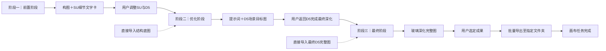

# GPT Infinite Canvas V3 三阶段工作流优化项目书

版本：V2.1

编制日期：2026-08-09

项目位置：`D:\OneDrive - 静超科技\D5-AI-Pipeline\canvas`

项目性质：既有画布产品的工作流重构；画布不控制 D5、SketchUp 或 Photoshop

---

## 一、项目摘要

本项目拟将 GPT Infinite Canvas 从“四阶段、三动作自由组合”的通用图片工作台，收敛为面向建筑效果图生产的三阶段画布：

```text
阶段一｜前置阶段
锁定构图与审查SU可见细节，返回纯文字优化建议

阶段二｜优化阶段
生成或优化提示词，生成D5场景目标图，交给用户返回D5深化

阶段三｜最终阶段
以最终D5完整图深化玻璃反射与内透，选定成果并批量导出
```

三阶段是三种独立专业任务，不是必须逐级解锁的流水线。用户可以从任意阶段开始：可直接导入一张视角图进入前置阶段，也可跳过前置阶段直接进入优化阶段，或直接导入最终 D5 完整图进入最终阶段。

画布的最终边界为：用户选定玻璃深化图后，将所有选定成果批量导出到用户指定文件夹，画布任务结束。后续 Photoshop 操作全部由用户在画布之外人工完成。

---

## 二、优化依据

### 2.1 阶段一不需要同角度候选图比较

用户在进入画布前已经完成视角选择。前置阶段不会为同一个角度同时输入多张候选视角，只会输入一张已经选定的 D5 视角图，让 AI 判断：

- 焦距是否合适；
- 相机高度和俯仰是否合理；
- 建筑在画面中的占比；
- 左右、上下留白；
- 两点透视或垂直关系；
- 前景遮挡、道路引导和视觉重心；
- 当前视角可见的 SU 模型细节是否足够。

多个不同视角可以一次选择并建立批次，但每张 D5 视角图必须形成一个独立任务和一张独立文字卡，不得将不同视角作为同一构图方案进行比较。

### 2.2 构图审查与 SU 细节审查应合并

前置 D5 视角已经接近正式视角，后续通常只是焦距、构图和相机位置的微调。这些调整不会显著改变当前视角对 SU 可见细节的判断，因此没有必要将构图审查和 SU 细节审查拆成两次上传、两轮文字返回和两个状态节点。

合并后的前置阶段一次回答两个问题：

1. 当前相机和构图还需要怎样微调；
2. 为保证这个视角最终表现成立，SU 中还需补充哪些真正可见的细节。

### 2.3 画布只保留三类最终产物

| 阶段 | 主要产物 | 是否生图 |
|---|---|---|
| 前置阶段 | 每个视角一张构图＋SU细节文字卡 | 否 |
| 优化阶段 | 提示词文字卡＋D5场景目标图 | 是，用户明确发起 |
| 最终阶段 | 玻璃深化完整图＋批量导出文件 | 是，固定任务 |

---

## 三、产品目标与边界

### 3.1 建设目标

- 将原阶段一和原阶段二合并为一个前置阶段；
- 将前置阶段从“多图比较”改为“多视角分别分析”；
- 为每张视角图返回独立、可编辑、可追溯的文字建议；
- 将原阶段三改为优化阶段，明确目标图只用于指导 D5；
- 将原阶段四改为最终阶段，包含玻璃深化、选图和批量导出；
- 支持从任意阶段直接开始，不用补齐前序状态；
- 让界面根据阶段自动选择正确动作，减少无效按钮；
- 保留严格串行、失败暂停、人工接管、原图只读和版本追溯；
- 将《已修复问题与回归保护基线》作为每次版本升级的准入条件；
- 三阶段升级只调整工作流组织，不重写已经稳定的保存、撤销、任务、资产和安全底座。

### 3.2 产品边界

- 不控制 SketchUp、D5 或 Photoshop；
- 不在画布中登记 Transparent、AO、Material ID、PSD 或其他后期文件；
- 不生成 Photoshop 任务、图层、蒙版或插件指令；
- 不让 AI 自动选定最终成果；
- 不将风格参考图当作建筑结构依据；
- 不覆盖原图、已有生成图或导出目录中的同名文件；
- 不因前序阶段未在画布中执行而禁用当前阶段。

---

## 四、V3 三阶段目标流程



推荐顺序用于表达生产逻辑，不用于限制用户操作。

---

## 五、阶段一｜前置阶段

### 5.1 阶段定位

一次完成当前视角的相机、焦距、构图和 SU 可见细节审查，只返回文字，不生成图片。

### 5.2 输入规则

每个视角任务的主输入固定为：

```text
1张已经选定的D5视角图
```

可选增加：

```text
1张与该D5视角方向对应的SU截图
```

输入语义：

- D5 图决定当前相机、焦距感、构图和最终可见范围；
- SU 截图只用于核对建模深度和可见细节；
- 没有 SU 截图时，AI 仍可根据 D5 图判断构图和画面中暴露的细节问题，但不得虚构未显示的模型状态；
- 不允许为同一个任务输入多张同角度候选图进行选优。

### 5.3 多视角批量规则

用户可以一次选择多张不同视角图，例如：

```text
1人视.png
2鸟瞰.png
3沿街.png
```

系统应建立三个独立串行任务：

```text
任务1：1人视 → 1人视文字卡
任务2：2鸟瞰 → 2鸟瞰文字卡
任务3：3沿街 → 3沿街文字卡
```

不同视角之间不得互相比较优劣，不共享结论，不因其中一张失败而丢失其他视角已完成的结果。

如需同时提供 SU 截图，画布应先将每张 D5 图与对应 SU 图配对，再建立任务；不得把多张 D5 图和多张 SU 图混入一个附件集合让 AI 自行猜测配对关系。

### 5.4 固定输出格式

每个视角返回一张独立文字卡：

```text
【视角结论】
当前视角是否基本成立，一句话说明。

【主要问题】
最多3项，只写影响最终画面的主要问题。

【相机与构图调整】
明确焦距、相机高度、俯仰、建筑占比、留白或裁切的调整动作。

【SU可见细节】
按P1／P2／P3列出最多5项，只检查当前视角可见且能影响轮廓、阴影、材质或玻璃边界的内容。

【交给D5／不值得制作】
说明哪些内容交给D5，哪些低收益细节无需建模。

【唯一下一步】
本轮最优先执行的一项调整。
```

### 5.5 操作约束

- 固定动作为“分析并返回文字”；
- 不提供常规“生成提示词”和“按提示词生图”入口；
- 不要求用户在画布中正式锁定相机后才能进入下一阶段；
- 用户可以直接将当前图发送到优化阶段；
- 文字卡可编辑、复制、再次发送和保存到本地记录。

---

## 六、阶段二｜优化阶段

### 6.1 阶段定位

根据结构底图、可选风格参考和项目要求，先形成可编辑提示词，再由用户明确发起场景目标图生成。目标图用于指导用户返回 D5 完成材质、光影、景观、人物和车辆深化，不作为最终交付图。

### 6.2 输入规则

必需输入：

```text
1张结构与构图依据图
```

可选输入：

```text
1张风格参考图
项目属性、时间、人物、车辆、植物和氛围要求
阶段一文字卡中的有效结论
```

结构底图始终决定建筑、场地、相机、透视、画幅和裁切；风格参考只提供色彩、材质、光影、配景和氛围。

### 6.3 两步动作

```text
动作A：生成或优化提示词
→ 返回D5调整建议、最终提示词和禁止项

动作B：按已确认提示词生成目标图
→ 返回完整画幅的D5场景目标图
```

没有用户明确发起动作 B 时不得自动生图。

### 6.4 输出与状态

- 提示词结果以可编辑文字卡返回；
- 目标图用途固定为 `d5-scene-target`；
- 目标图必须注明“用于 D5 深化参考，不是结构依据或最终交付图”；
- 每张结构底图独立处理；
- 主视觉可生成 2 版，普通视角默认 1 版，按需追加；
- 用户选定目标图后，下一步固定显示“返回 D5 完成最终深化”。

---

## 七、阶段三｜最终阶段

### 7.1 阶段定位

以最终 D5 完整效果图为唯一输入，固定深化玻璃反射与室内内透。阶段内完成生成、验收、成果选择和批量导出；导出完成后画布任务结束。

### 7.2 输入规则

每个视角任务只输入：

```text
1张最终D5完整效果图
```

不得输入或索要玻璃蒙版、Transparent、AO、Material ID、SU 截图或其他后期通道。

用户可直接从最终阶段开始，不要求前置阶段或优化阶段在画布中存在记录。

### 7.3 玻璃深化规则

- 下部及首层玻璃以真实、克制的暖色内透和入口纵深为主，同时保留适量室外反射；
- 上部玻璃以蓝灰天空、树木和环境冷色反射为主，只保留弱楼板、顶棚和室内暗部；
- 不让整层同时发光；
- 不增加清晰家具、明显人物、文字、标识或水印；
- 保持原图的建筑、窗框、每块窗格、场地、道路、树木、人物、车辆、天空和光线方向；
- 返回完整效果图，不返回局部裁切、透明素材或玻璃蒙版。

### 7.4 批量与验收

- 多个最终 D5 视角可以建立批次，但每张图是一个独立任务；
- 严格串行，上一张完成、回收和验收后再发送下一张；
- 每个视角默认先生成 1 版，失败或用户主动要求时追加；
- 宽高比不同、画面被裁切或扩图、结构或配景变化时暂停当前批次；
- 宽高比相同但像素不同，可保留原始结果并生成 `_PS对齐` 副本；
- 只有验收通过的结果可以进入待导出集合。

### 7.5 成果选择与批量导出

```text
逐视角选择玻璃深化图
→ 点击“批量导出”
→ 用户指定目标文件夹
→ 预览待导出清单
→ 校验目标路径与文件冲突
→ 批量复制全部选定成果
→ 写入画布本地导出日志
→ 画布任务完成
```

导出规则：

- 只导出用户明确选定的玻璃深化图；
- 文件名使用 `视角名_玻璃整图_01` 顺延；
- 同一视角允许选定多个版本；
- 不覆盖目标目录已有文件；
- 导出失败时保留已完成状态，可继续导出剩余文件；
- 不重复复制已经成功导出的同一版本；
- 导出日志保存在画布项目本地，不强制污染用户指定文件夹；
- 所有选定成果成功导出后，画布状态变为“已完成”。

---

## 八、灵活路由与阻断规则

### 8.1 允许的直接入口

| 用户情况 | 允许动作 |
|---|---|
| 已有选定D5视角 | 直接进入前置阶段 |
| 不需要构图与SU建议 | 直接进入优化阶段 |
| 已有场景提示词 | 在优化阶段直接编辑或确认提示词 |
| 已有最终D5完整图 | 直接进入最终阶段 |

跳过的阶段只记录为“未在画布执行”或“外部已完成”，不强制填写原因，也不阻断后续操作。

### 8.2 只保护当前动作的硬阻断

- 前置阶段没有 D5 视角主图；
- 用户要求 SU 细节审查但没有为当前 D5 图配对 SU 截图；
- 优化阶段没有结构与构图依据图；
- 结构底图与风格参考角色冲突；
- 最终阶段没有最终 D5 完整图；
- 当前已有未结束任务；
- 最终阶段返回图宽高比异常、裁切或结构漂移；
- 批量导出没有选定成果、目标目录无效或无写入权限。

前序阶段未完成只能显示提醒，不得禁用当前阶段主操作。

---

## 九、产品信息架构

### 9.1 三阶段主导航

```text
前置阶段
├─ 导入D5视角
├─ 配对SU截图（可选）
├─ 批量生成文字建议
└─ 查看／编辑文字卡

优化阶段
├─ 指定结构底图
├─ 指定风格参考（可选）
├─ 生成／优化提示词
└─ 按提示词生成D5目标图

最终阶段
├─ 导入最终D5完整图
├─ 批量玻璃深化
├─ 验收与选择成果
└─ 批量导出
```

### 9.2 视角卡片

每个视角使用一张简化状态卡：

```text
视角：1人视

前置建议：已返回／未执行
场景目标：已选定／未执行
最终D5：已登记／未登记
玻璃深化：处理中／已验收／未执行
导出状态：待导出／已导出
```

卡片不要求所有状态依次完成，只显示当前已有成果和推荐下一步。

### 9.3 工作区布局

- 左侧：项目、视角列表和三阶段导航；
- 中部：图片、批注、文字卡和版本关系画布；
- 右侧：当前阶段的输入角色、主操作、提示词预览和验收项；
- 底部：串行批次、进度、失败暂停和人工接管。

---

## 十、状态与数据模型

建议将项目文档升级为 `schemaVersion: 2.0`：

```ts
type WorkflowStageV3 =
  | "preflight"
  | "scene-optimization"
  | "final-glass"
  | "completed";

interface ViewpointWorkflowV3 {
  id: string;
  name: string;

  preflight: {
    d5ViewVersionId: string | null;
    suReferenceVersionId: string | null;
    conclusionCardId: string | null;
    status: "pending" | "completed" | "not-run" | "external";
  };

  sceneOptimization: {
    structureBaseVersionId: string | null;
    styleReferenceVersionId: string | null;
    promptCardId: string | null;
    candidateVersionIds: string[];
    selectedVersionId: string | null;
    status: "pending" | "prompt-ready" | "generated" | "selected" | "not-run";
  };

  finalGlass: {
    finalD5VersionId: string | null;
    candidateVersionIds: string[];
    selectedVersionIds: string[];
    validation: "pending" | "passed" | "failed";
    status: "pending" | "generated" | "selected" | "not-run";
  };

  export: {
    targetDirectory: string | null;
    exportedVersionIds: string[];
    exportedFiles: string[];
    exportedAt: string | null;
    status: "pending" | "partial" | "completed";
  };
}
```

### 10.1 批次数据规则

前置阶段批次中的每个 item 必须对应一个视角：

```ts
interface PreflightBatchItem {
  d5ViewVersionId: string;
  suReferenceVersionId?: string;
  resultTextCardId?: string;
}
```

不能再使用“一个任务包含多张候选视角”的数据结构。

### 10.2 旧项目迁移

```text
旧 stage-1 + 旧 stage-2
→ 新 preflight

旧 stage-3
→ 新 scene-optimization

旧 stage-4
→ 新 final-glass

旧 final
→ 根据是否已导出映射为 final-glass 或 completed
```

迁移时保留全部图片、父子版本、文字卡、任务记录和采用状态；无法自动判断的旧阶段一、二文字卡统一挂入前置阶段历史，不强制用户重新分类。

---

## 十一、功能调整清单

### 11.1 删除或隐藏

- 原“阶段一：多张候选视角比较”；
- 原独立“阶段二：SU可见细节审查”；
- 原四阶段导航和 `stage-1`～`stage-4` 用户界面命名；
- 前置阶段的提示词生成和生图入口；
- 独立最终检查阶段；
- Photoshop、Transparent、PSD、后期通道和插件相关功能；
- 前序阶段未完成时禁用后续阶段的硬门控。

### 11.2 保留并强化

- 一张 D5 图对应一个独立任务；
- D5 与对应 SU 截图的一对一配对；
- 结构基准与风格参考角色；
- 文字卡编辑、复制、再次发送和本地保存；
- 父子版本、原图只读和哈希去重；
- 严格串行、失败暂停、登录验证和人工接管；
- 最终阶段宽高比和结构硬校验；
- 用户选图、指定文件夹和批量安全导出。

### 11.3 新增

- 三阶段主导航；
- 前置阶段“多视角分别分析”批次；
- D5／SU 一对一配对界面；
- 合并后的构图＋SU细节文字卡模板；
- 优化阶段的提示词—目标图两步操作；
- 最终阶段的玻璃深化—验收—选择—导出闭环；
- 旧四阶段项目到新三阶段的迁移器。

---

## 十二、技术改造范围

### 12.1 无限画布 `01_canvas_app`

- 重构 `project-state.ts`：使用 `preflight`、`scene-optimization`、`final-glass`、`completed`；
- 重构 `batch-queue.ts`：前置阶段每张 D5 图生成一个 item，不再合并候选视角；
- 重构 `fixed-workflow-prompts.ts`：收敛为三个阶段模板；
- 调整 `workflow-status.ts`：取消跨阶段硬门控，只校验当前任务；
- 调整 `App.tsx`：三阶段导航、D5／SU 配对、逐视角文字卡、最终批量导出；
- 增加旧项目 schema 迁移和迁移测试。

### 12.2 本地桥接 `02_bridge_service`

- 支持多视角独立文字任务的结果回收；
- 保留任务串行、幂等、失败暂停和人工接管；
- 支持用户指定文件夹的批量安全导出；
- 增加导出记录、部分失败恢复、哈希去重和顺延命名。

### 12.3 浏览器扩展 `03_browser_extension`

- 保留现有上传、提交、文字／图片结果回收；
- 前置阶段按 item 逐张发送，不把不同视角合并到同一任务；
- 最终阶段继续校验完整画幅结果；
- 登录失效、网页验证或页面状态不确定时暂停。

### 12.4 共享协议 `04_shared_packages`

- 增加三阶段枚举和 `PreflightBatchItem`；
- 增加 D5／SU 配对校验；
- 增加 `d5-scene-target`、`glass-deepened-full-frame`、`ExportRecord`；
- 更新任务、项目和导出记录的 JSON 校验器。

### 12.5 回归保护与兼容性

实施和发布必须遵循[《已修复问题与回归保护基线》](已修复问题与回归保护基线.md)：

- 当前 105 项通过测试只作为稳定底座基线：共享协议 3 项、本地桥接 15 项、浏览器扩展 11 项、画布应用 76 项；
- 当前阶段一、阶段二没有完整业务流程测试，105 项通过不能作为这两个阶段的行为正确性证明；
- 项目保存与恢复、撤销重做、图片内存管理、任务状态与恢复、重复提交保护、登录与本地安全、文字卡、项目导航和发布包完整性属于稳定底座；
- 稳定底座的既有测试不得因三阶段改造而删除、跳过或降低断言强度；
- 旧四阶段测试若与新流程语义冲突，必须先建立明确映射，再用等价的三阶段测试替换；不得以“流程已变化”为由直接取消保护；
- 旧项目迁移只能新增或转换数据，不得覆盖原始资产，也不得丢失图片、任务、批注、文字卡和版本关系；
- 每次升级必须保留改造前状态、差异和测试结果；未通过基线验收不得制作正式发布包。

---

## 十三、实施计划

### 第一阶段：三阶段数据模型与迁移（P0）

周期建议：2～3 个开发日。

- 记录当前工作区状态和差异，待用户确认后冻结可追溯的升级前基线；
- 先运行并保存 105 项现有底座测试结果，不在失败基线上开始改造；
- 在修改阶段一、阶段二前，先补最小行为刻画测试；无法自动化的交互保存输入、步骤和预期结果；
- 建立三阶段 schema；
- 合并旧阶段一、二；
- 完成旧项目迁移器；
- 删除跨阶段硬门控；
- 增加迁移和阶段路由测试。

### 第二阶段：前置阶段重构（P0）

周期建议：3～4 个开发日。

- 改为一张 D5 图一个任务；
- 支持不同视角批量分别分析；
- 建立 D5／SU 配对；
- 实现合并文字卡模板；
- 删除同角度候选比较界面。

### 第三阶段：优化与最终阶段收口（P0）

周期建议：3～4 个开发日。

- 重命名并收口优化阶段；
- 固化提示词与目标图两步操作；
- 将玻璃深化、验收、选择、导出整合为最终阶段；
- 保留任意阶段直接入口。

### 第四阶段：批量导出与文档（P1）

周期建议：2～3 个开发日。

- 指定文件夹批量导出；
- 不覆盖、顺延命名和失败恢复；
- 更新 README、使用说明和测试项目；
- 使用真实项目完成一次三阶段试运行。

总周期建议：10～14 个开发日，不含设计师试用反馈修正。

---

## 十四、测试与验收标准

### 14.1 前置阶段

- 单张 D5 视角可以独立创建文字任务；
- 多张不同视角会创建多个独立串行 item；
- 不再出现多张候选视角比较逻辑；
- 每张视角返回独立文字卡；
- D5 与 SU 截图必须明确配对；
- 没有 SU 截图时仍可完成构图审查，但不会虚构模型细节；
- 前置阶段不提供生图入口。

### 14.2 优化阶段

- 可跳过前置阶段直接进入；
- 必须明确结构底图，风格参考可选；
- 提示词与生图为两个独立动作；
- 未经用户明确发起不得自动生图；
- 目标图标记为 D5 参考，不作为最终交付图。

### 14.3 最终阶段

- 可直接导入最终 D5 完整图进入；
- 每个任务只上传一张最终 D5 完整图；
- 不要求蒙版或后期通道；
- 返回完整画幅玻璃深化图；
- 宽高比、裁切或结构异常时暂停；
- 只有用户选定的成果进入导出清单；
- 可一次指定文件夹并批量导出；
- 导出不覆盖，部分失败可继续；
- 全部选定成果导出成功后画布任务完成。

### 14.4 技术与安全

- 旧项目迁移不丢失图片、版本、文字卡和任务记录；
- 全部类型检查、构建和现有测试通过，稳定底座能力不得回退；
- 105 项现有测试只作为稳定底座能力清单，不代表阶段一、阶段二已有业务回归保护；
- 阶段一、阶段二新增专项行为测试后，测试增删必须按名称、保护能力和替代关系记录；
- 与旧四阶段语义冲突的测试，只有在等价三阶段测试已经建立并通过后才可替换；
- 新增三阶段路由、批次拆分、D5／SU 配对、迁移和导出测试；
- 本地服务继续仅监听 `127.0.0.1`；
- 原始资产只读，任何导出不覆盖已有文件；
- 登录、验证、生成失败和页面状态异常时安全暂停。

### 14.5 发布准入

- 执行 `npm test` 与 `npm run test:canvas`，全部通过；
- 执行发布校验、制作发布包并对解压后的包进行冒烟测试；
- 使用旧项目副本验证打开、保存、刷新恢复和 schema 迁移；
- 人工验证撤销重做、任务暂停恢复、重复提交拦截和用户指定文件夹导出；
- 形成版本测试报告，列明新增、替换和保留的测试，不接受无说明的测试删除；
- 任何基础能力回退均视为发布阻断，不得以新增三阶段功能抵消。

---

## 十五、项目指标

试运行三个真实建筑项目后统计：

- 前置阶段每个视角从导入到文字卡返回的操作次数；
- 多视角批量中独立任务正确率，目标 100%；
- D5／SU 自动或人工配对正确率，目标 100%；
- 同一视角重复上传和重复审查次数；
- 优化阶段从提示词到目标图的人工确认次数；
- 最终阶段画幅异常拦截率，目标 100%；
- 批量导出成功率和部分失败恢复成功率；
- 旧项目迁移成功率 100%，数据丢失率 0。

---

## 十六、风险与应对

| 风险 | 应对措施 |
|---|---|
| 多张不同视角被错误合并为一个任务 | 批次数据强制一张 D5 主图对应一个 item |
| D5 与 SU 截图配对错误 | 提交前显示配对预览，未确认配对时不进行SU专项审查 |
| 没有 SU 截图却输出虚构模型建议 | 提示词明确限制为“仅根据可见画面判断” |
| 合并后文字建议过长 | 主要问题最多3项，SU细节最多5项，保留唯一下一步 |
| 用户跳过前置阶段后受到阻断 | 取消跨阶段硬门控，只校验当前任务输入 |
| 最终玻璃图结构漂移 | 宽高比与结构验收失败时暂停，不进入导出清单 |
| 批量导出中途失败 | 逐文件记录成功状态，允许从剩余项继续 |
| 旧四阶段项目无法准确映射 | 原阶段一、二均归入前置历史，无法分类时保留原标签 |
| 工作流升级导致已修复问题复发 | 以回归保护基线、等价测试映射和发布准入清单共同阻断 |

---

## 十七、最终交付物

1. 三阶段画布数据模型与旧项目迁移器；
2. 三阶段主导航和灵活直接入口；
3. 多视角分别分析的前置阶段批次；
4. D5／SU 一对一配对功能；
5. 构图＋SU细节合并文字卡；
6. 提示词＋D5目标图优化阶段；
7. 玻璃深化＋选图＋批量导出最终阶段；
8. 用户指定文件夹的安全批量导出和本地日志；
9. V3 测试、README、迁移说明和真实项目试运行记录；
10. 已修复问题与回归保护基线、版本测试报告和测试替换映射表。

---

## 十八、实施结论

V3 的核心产品逻辑调整为：

> 前置阶段一次解决构图与 SU 可见细节问题；优化阶段形成 D5 深化目标；最终阶段固定处理玻璃、选择成果并导出。多个视角可以批量进入画布，但每个视角始终独立分析、独立生成、独立留痕。

建议首先完成三阶段数据模型和前置阶段批次重构。这两项决定后续界面、提示词、迁移和导出逻辑，不宜在旧四阶段模型上继续叠加功能。
